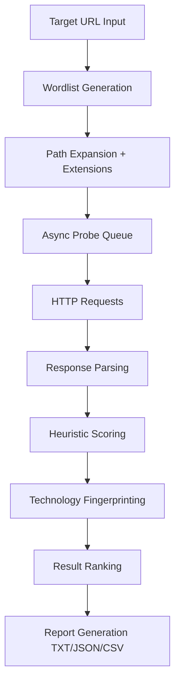
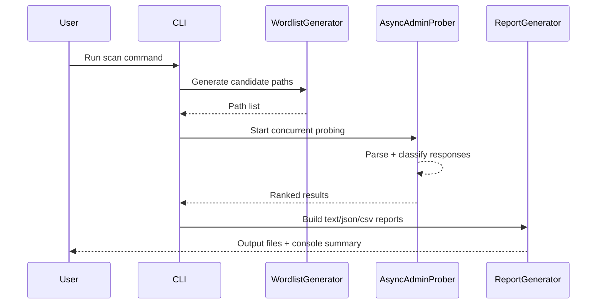

<div align="center">

# OmniAdminFinder

**Asynchronous admin interface discovery engine for authorized security research**

[](https://github.com/PN777/OmniAdminFinder/actions)
[](https://www.python.org/)
[](./LICENSE)
[](https://github.com/PN777/OmniAdminFinder/issues)
[](https://github.com/PN777/OmniAdminFinder/stargazers)

</div>

> [!IMPORTANT]
> OmniAdminFinder is intended **only for authorized security testing** and defensive research.
> You must have explicit permission before scanning any target.

---

## 📌 Project Description

OmniAdminFinder is a high-performance asynchronous discovery tool that helps security researchers identify potential administrative interfaces across web targets.  
It combines:

- intelligent path enumeration,
- concurrent HTTP probing,
- response fingerprinting,
- technology detection, and
- confidence-based ranking

to surface likely admin/login endpoints quickly and systematically.

---

## ✨ Key Highlights

- ⚡ **Asynchronous scanning engine** built for high throughput
- 🧠 **Smart path generation** with domain/path-aware mutations
- 🔍 **Response analysis** using status, title, forms, headers, and body signals
- 🧩 **Technology fingerprinting** (CMS/framework/admin patterns)
- 📊 **Multi-format reporting** (text, JSON, CSV)
- 🛡️ **Operational controls** (timeouts, retries, rate limiting, proxy, redirect policy)

---

## 📚 Table of Contents

- [Why OmniAdminFinder?](#-why-omniadminfinder)
- [Features](#-features)
- [Architecture Overview](#-architecture-overview)
- [Discovery Pipeline](#-discovery-pipeline)
- [Internal Workflow (Mermaid)](#-internal-workflow-mermaid)
- [Requirements](#-requirements)
- [Supported Platforms](#-supported-platforms)
- [Installation](#-installation)
  - [Linux](#linux)
  - [macOS](#macos)
  - [Windows](#windows)
- [Quick Start](#-quick-start)
- [CLI Reference](#-cli-reference)
- [Usage Examples](#-usage-examples)
  - [Beginner](#beginner)
  - [Intermediate](#intermediate)
  - [Advanced](#advanced)
- [Example Output](#-example-output)
- [Output Formats Explained](#-output-formats-explained)
- [Project Structure](#-project-structure)
- [Performance Characteristics](#-performance-characteristics)
- [Troubleshooting](#-troubleshooting)
- [FAQ](#-faq)
- [Development Setup](#-development-setup)
- [Contributing](#-contributing)
- [Security](#-security)
- [Roadmap](#-roadmap)
- [Changelog](#-changelog)
- [License](#-license)
- [Credits](#-credits)
- [Acknowledgements](#-acknowledgements)
- [Responsible-Use Disclaimer](#-responsible-use-disclaimer)

---

## ❓ Why OmniAdminFinder?

Many admin discovery workflows are either too noisy, too slow, or too shallow in analysis. OmniAdminFinder focuses on practical research ergonomics:

- **Speed** from async concurrency
- **Signal quality** via confidence scoring
- **Context** through fingerprinting and metadata
- **Actionable output** via ranked findings and structured export

---

## 🚀 Features

- **Asynchronous + Concurrent Scanning**
  - Efficiently probes large candidate path sets using async HTTP.
- **Intelligent Enumeration**
  - Combines default paths, extended variants, target-derived mutations, and optional robots/sitemap hints.
- **Confidence Scoring**
  - Heuristic ranking based on:
    - status codes,
    - response title/body,
    - form patterns,
    - redirects,
    - headers,
    - detected technologies.
- **Technology Detection**
  - Identifies common signatures (e.g., CMS/framework/admin services).
- **Export & Reporting**
  - Generates human-readable text report plus machine-friendly JSON/CSV.
- **Operational Controls**
  - Timeout/retry strategy, rate-limit controls, redirect policy, SSL toggle, custom UA, proxy support.

---

## 🧱 Architecture Overview

OmniAdminFinder is organized around four core components:

1. **Wordlist Generator**  
   Produces candidate paths using default dictionaries + contextual mutations.
2. **Async Scanner Engine**  
   Performs concurrent requests with retry/rate/redirect controls.
3. **Classifier & Fingerprinter**  
   Scores responses and infers likely admin interfaces.
4. **Report Generator**  
   Produces text, JSON, and CSV artifacts for triage and automation.

---

## 🔄 Discovery Pipeline

1. Normalize target base URL.
2. Build candidate path set:
   - default + extended dictionaries,
   - domain/path mutations,
   - optional robots/sitemap extraction.
3. Expand extensions where configured (`.php`, `.asp`, etc.).
4. Dispatch async probes with concurrency semaphore.
5. Parse response metadata:
   - status,
   - title,
   - headers,
   - form actions/inputs,
   - body preview/hash,
   - redirects.
6. Run heuristic classification and technology detection.
7. Rank findings by confidence score.
8. Emit reports (`.txt`, `.json`, `.csv`).

---

## 📈 Internal Workflow (Mermaid)





---

## 🧰 Requirements

| Component | Minimum |
|---|---|
| Python | 3.10+ recommended |
| OS | Linux / macOS / Windows |
| Network | Outbound HTTP/HTTPS access |
| Dependencies | See `requirements.txt` |

> [!TIP]
> Use a virtual environment for clean dependency isolation.

---

## 🖥️ Supported Platforms

- ✅ Linux
- ✅ macOS
- ✅ Windows 10/11

---

## 📦 Installation

### Linux

```bash
git clone https://github.com/PN777/OmniAdminFinder.git
cd OmniAdminFinder
python3 -m venv .venv
source .venv/bin/activate
python -m pip install --upgrade pip
pip install -r requirements.txt
python admin_finder.py --help
```

### macOS

```bash
git clone https://github.com/PN777/OmniAdminFinder.git
cd OmniAdminFinder
python3 -m venv .venv
source .venv/bin/activate
python -m pip install --upgrade pip
pip install -r requirements.txt
python admin_finder.py --help
```

### Windows (PowerShell)

```powershell
git clone https://github.com/PN777/OmniAdminFinder.git
cd OmniAdminFinder
py -3 -m venv .venv
.venv\Scripts\Activate.ps1
python -m pip install --upgrade pip
pip install -r requirements.txt
python admin_finder.py --help
```

---

## ⚡ Quick Start

```bash
python admin_finder.py https://example.com
```

This performs a default scan and writes output files with the default prefix (e.g. `admin_scan.*`).

---

## 🧾 CLI Reference

```bash
python admin_finder.py [OPTIONS] <url>
```

### Arguments & Options

| Option | Type | Default | Description |
|---|---:|---:|---|
| `url` | str | — | Target base URL (e.g. `https://example.com`) |
| `-w, --wordlist` | file | — | Custom path wordlist (one path per line) |
| `-t, --threads` | int | `50` | Max concurrent requests |
| `-T, --timeout` | float | `5.0` | Request timeout in seconds |
| `-r, --rate-limit` | float | `0.0` | Delay between requests (seconds) |
| `-o, --output` | str | `admin_scan` | Output filename prefix |
| `-v, --verbose` | flag | `false` | Enable verbose logging |
| `--no-ssl-verify` | flag | enabled in code path | Disable SSL certificate verification |
| `--extensions` | csv | built-in | Custom extension list |
| `--user-agent` | str | browser-like UA | Override User-Agent header |
| `--proxy` | str | — | Proxy URL (e.g. `http://127.0.0.1:8080`) |
| `--max-redirects` | int | `5` | Redirect follow limit |
| `--no-follow-redirects` | flag | follow | Disable redirect following |
| `--no-banner` | flag | show banner | Suppress startup banner |

> [!NOTE]
> Tune `--threads`, `--timeout`, and `--rate-limit` based on target stability and authorization boundaries.

---

## 🧪 Usage Examples

### Beginner

**1) Default scan**
```bash
python admin_finder.py https://target.tld
```

**2) Verbose scan**
```bash
python admin_finder.py https://target.tld -v
```

### Intermediate

**3) Use custom wordlist**
```bash
python admin_finder.py https://target.tld -w custom_paths.txt
```

**4) Increase concurrency + timeout**
```bash
python admin_finder.py https://target.tld -t 100 -T 10
```

**5) Save with custom output prefix**
```bash
python admin_finder.py https://target.tld -o engagement_01
```

### Advanced

**6) Rate-limited scan**
```bash
python admin_finder.py https://target.tld -r 0.25
```

**7) Proxy + no SSL verify**
```bash
python admin_finder.py https://target.tld --proxy http://127.0.0.1:8080 --no-ssl-verify
```

**8) Custom extension scan**
```bash
python admin_finder.py https://target.tld --extensions ".php,.asp,.aspx,.jsp,.do"
```

**9) Disable redirect following**
```bash
python admin_finder.py https://target.tld --no-follow-redirects
```

---

## 🖨️ Example Output

```text
================================================================================
OMNIADMINFINDER – DISCOVERY REPORT
Target: https://example.com
Timestamp: 2026-06-27 12:34:56
Total paths probed: 842
Likely admin pages: 7
================================================================================

1. https://example.com/wp-admin
   Status: 302  |  Score: 92%
   Title: WordPress › Login
   Tech: PHP, WordPress
   Forms: 1 detected
   Redirects to: https://example.com/wp-login.php?redirect_to=...
   Response time: 233.4ms, Length: 0 bytes
```

---

## 📄 Output Formats Explained

| File | Purpose | Best For |
|---|---|---|
| `*.txt` | Human-readable ranked summary | Manual triage |
| `*.json` | Structured findings + stats | Automation/integration |
| `*.csv` | Flat tabular export | Spreadsheet analysis |

---

## 🗂️ Project Structure

```text
OmniAdminFinder/
├── admin_finder.py
├── README.md
├── LICENSE
├── CHANGELOG.md
├── ROADMAP.md
├── CONTRIBUTING.md
├── SECURITY.md
├── CODE_OF_CONDUCT.md
├── requirements.txt
├── pyproject.toml
├── .gitignore
└── .github/
    ├── pull_request_template.md
    ├── ISSUE_TEMPLATE/
    │   ├── bug_report.yml
    │   ├── feature_request.yml
    │   └── config.yml
    └── workflows/
        └── ci.yml
```

---

## ⚙️ Internal Workflow Notes

<details>
<summary><strong>Scanner engine behavior</strong></summary>

- Uses async session pooling and semaphore-bound concurrency.
- Supports retry with backoff for transient failures.
- Captures response body preview + hash for lightweight fingerprinting.
- Scores likely admin endpoints and sorts descending by confidence.
</details>

<details>
<summary><strong>Confidence heuristics</strong></summary>

Scoring considers status code patterns, title/body/admin keywords, forms, redirect targets, and signature hints from headers/content.
</details>

---

## 📊 Performance Characteristics

Performance depends on:
- thread/concurrency setting,
- timeout/retry policy,
- target responsiveness,
- network conditions.

Practical guidance:
- Start with defaults (`-t 50`).
- Increase to `-t 100` only for stable, authorized targets.
- Use `-r` in sensitive environments to reduce load.

---

## 🛠️ Troubleshooting

| Problem | Likely Cause | Fix |
|---|---|---|
| SSL errors | self-signed/invalid cert | use `--no-ssl-verify` only when authorized |
| Too many timeouts | low timeout / unstable target | raise `-T`, reduce `-t` |
| Very slow scan | strict rate limit or network latency | lower `-r`, tune `-t` |
| Empty findings | conservative signals / limited paths | supply custom `-w` and extension set |
| Proxy not used | malformed proxy URL | confirm `http://host:port` syntax |

---

## ❔ FAQ

**Q: Is this a vulnerability scanner?**  
A: No. It is a discovery/fingerprinting utility for potential admin interfaces.

**Q: Can I run this against any internet host?**  
A: Only with explicit authorization.

**Q: Does it support authenticated scanning?**  
A: It supports headers/cookies/user-agent/proxy controls; advanced authenticated flows can be extended in code.

---

## 🧪 Development Setup

```bash
git clone https://github.com/PN777/OmniAdminFinder.git
cd OmniAdminFinder
python -m venv .venv
source .venv/bin/activate  # Windows: .venv\Scripts\Activate.ps1
pip install -r requirements.txt
pip install pytest ruff
ruff check .
pytest -q
```

---

## 🤝 Contributing

Please read [CONTRIBUTING.md](./CONTRIBUTING.md) before opening a PR.

- Open an issue first for large changes.
- Keep PRs focused and atomic.
- Add/update tests/docs where relevant.

---

## 🔐 Security

See [SECURITY.md](./SECURITY.md) for vulnerability reporting guidance and responsible disclosure.

---

## 🗺️ Roadmap

See [ROADMAP.md](./ROADMAP.md) for planned milestones and long-term direction.

---

## 📝 Changelog

Project history is maintained in [CHANGELOG.md](./CHANGELOG.md).

---

## 📜 License

Distributed under the MIT License. See [LICENSE](./LICENSE).

---

## 🙌 Credits

- Maintained by [PN777](https://github.com/PN777)
- Built on Python async ecosystem (`aiohttp`, `asyncio`, etc.)

---

## 🌟 Acknowledgements

- Security research community best practices
- OWASP testing methodology concepts
- Inspiration from modern async tooling patterns

---

## ⚖️ Responsible-Use Disclaimer

This tool is provided for **authorized** security assessments, defensive operations, and education.  
Unauthorized scanning may violate laws, regulations, and terms of service.  
You are solely responsible for compliance in your jurisdiction and for obtaining explicit permission before use.